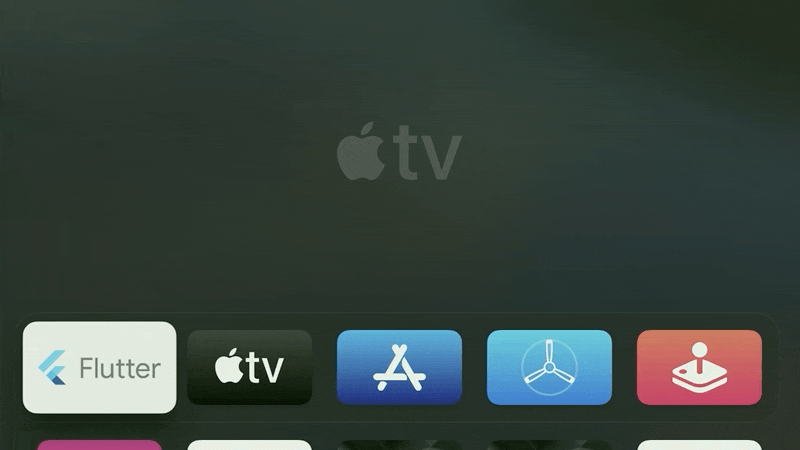

# Flutter for Apple TV

A modification of the Flutter engine + test application to demonstrate that Flutter applications runs on Apple TV

This project (and Liberty Global repositories referred to) are for testing purposes only!

Flutter and the related logo are trademarks of Google LLC
We are not endorsed by or affiliated with Google LLC.


## Approach:

- Engine:
  - Use `ios` target to compile `tvos` target
    - It is possible to create a new `tvos` target, but this would have impact and more files would need to be changed and therefore require more effort to maintain Apple TV support in the engine
      - This can be done by modifiying the makefiles in the different projects
      - See &#39;real\_tvos\_target&#39; branch (not finished!)
    - Instead of using `ios&` SDK, `tvos` SDK is used
  - Disable/replace code not supported by `tvos` SDK
  - Added support for Apple TV remote
    - Swipe
      - Based on gesture recognizer &amp; game controller
      - Created new channel to forward movement to application
      - Application translates movement to left, right, up &amp; down
        - Handling this in the application allows the application to optimize the speed etc per screen / use-case
    - Remote keys:
        - Menu, play-pause, … are mapped to key codes
        - Menu key is mapped to “popRoute” function, but could be mapped to ‘back’ key
    - Keyboard input:
        - 1.26: Support for ios keyboard and no modifications needed. 
        - In flutter 1.15/1.19/1.22 a subset of keys is mapped to "macos" and "Android" key codes
  - Enabled bitcode (mandatory for Apple TV)
  - Repositories modified
      - https://github.com/flutter/buildroot --> https://github.com/LibertyGlobal/flutter-tvos-buildroot  
      - https://github.com/flutter/engine    -->  https://github.com/LibertyGlobal/flutter-tvos-engine
      - https://dart.googlesource.com/sdk    --> https://github.com/LibertyGlobal/flutter-tvos-dart
      - https://skia.googlesource.com/skia   --> https://github.com/LibertyGlobal/flutter-tvos-skia
    - Tested flutter engines: 
        - 1.15, 1.19-candidate-4, 1.22-candidate.13, 1.26.0-17.6-pre, 2.0.4
- Framework
  - No modifications in &quot;flutter&quot; tool (/framework)
  - Platform `tvos` not supported, `ios` target cannot be used because without modifications it would the use wrong SDK(ios) to compile the application
- Application
    - Changes compared to `ios` application setup:
        - Modified main storyboard
        - Icon set for tvos
        - Custom script to compile application which replaces ‘code_backend.sh’ in the “build phases” step. This script is based on scripts from the engine test application which only use tools from the engine. The normal script cannot be used because it used the standard “flutter” tool which does not support ‘tvos’.
    - Copy generated resources from real 'ios' app target. The test app target actually overwrites the ios build to use the resources.
    - Change targets for application and pods to ‘tvos’ and set mininumm OS version to 12.0

## Known limitations

- Not all pods will compile. `ios` target is used and some API&#39;s are not supported by `tvos`. E.g. WebView
- No debugging capabilities
- No Apple TV look and feel widgets, no integration of virtual keyboard, ...
- Resource monitoring is not supported by tvos (using flutter tools)
 
## Known Issues
- When a debug version is installed on a simulator or Apple TV device, then the app will not load when selected on screen. It will only load from the xcode debugger. This is not an issue for release builds. This has most likely to do with the fact that the app is trying to connect to 127.0.0.1 which is not started because the flutter tools are not used.

## Supported devices
- Apple tvOS 12.0 or later

## Workarounds

- Disabled fork commands etc. in &quot;process\_macos.cc&quot;
  - This should not be needed and only be compiled for host
  - [https://github.com/dart-lang/sdk/issues/39918#issuecomment-569806159](https://github.com/dart-lang/sdk/issues/39918#issuecomment-569806159)
- Disabled fatal error in &quot;kernel\_translation\_helper.cc&quot;, still be investigated what the root cause is

## Setting up engine / development environment

- Host compilation (macos) fails on system with 16Gb memory, no issues on 32Gb mac
  - Added &#39;--no-lto&#39;, see [https://github.com/flutter/flutter/issues/57207](https://github.com/flutter/flutter/issues/57207)
- Based on instructions here: [_https://github.com/flutter/flutter/wiki/Setting-up-the-Engine-development-environment_](https://github.com/flutter/flutter/wiki/Setting-up-the-Engine-development-environment)_)_
- Create empty directory called `engine` for you local copy of the repository and `cd` into it. (some tools assume this folder name!)
- Create a `.gclient` file in engine directory with the following contents:
     ``` 
    {
        "managed": False,
        "name": "src/flutter",
        "url": "https://github.com/LibertyGlobal/flutter-tvos-engine.git@2.0.4",
        "custom_deps": {},
        "deps_file": "DEPS",
        "safesync_url": "",
    }
    ```
- Run `gclient sync` in engine directory
- See flutter wiki for Java SKD and &#39;ant&#39; dependencies
- Install &quot;flutter&quot; version `2.0.4` ([https://flutter.dev/docs/get-started/install/macos](https://flutter.dev/docs/get-started/install/macos))

## Compiling the engine

- The script will build 5 targets for TVOS in the src/out folder: 
    - **ios_debug_unopt, ios_debug_sim_unopt, ios_release, host_debug_unopt and host_release release**
- **Note:** *Fectching all repositories and compiling the engine for Apple TV (all targets) requires at leaste `29Gb` of free diskspace!*
- Run in `/engine/src/` script `sh ninja_build.sh` (located in script folder, see )
  - Add paramter `clean` for a full rebuild.
- Based on: [https://github.com/flutter/flutter/wiki/Compiling-the-engine](https://github.com/flutter/flutter/wiki/Compiling-the-engine). The problem with the order described on this wiki is that the generated files for the host point to the ios/tvos sdk instead of macos

## Compiling application

- 1st build real ios target to make sure the resources(images, fonts, ...) are generated by the flutter tools and can be used for tvos
  -  `flutter build ios`
- Note: the application will regardless of the target, always be compiled to `/build/ios/Release-iphoneos`. The main reasone for this is that the resouces generated by the normal ios build are located here and are re-used.
  - This means that if any of the resource will change, added or removed that normal ios build must be done first. In order to do this, the step below must be un done first!
- Rename tvos folder to ios
  - Flutter tools assume the folder name is `ios`. Flutter pub get will fail if the folder has a different name!
  - Run command: `sh scripts/switch_target.sh tvos`
  - (to switch back to ios: `sh scripts/switch_target.sh ios`)
- Run command: `flutter pub get`
- Go to `ios` folder
- Install/get cocoa pods
  - Run command: `pod install`
  - Pods target is automatically corrected from ios to tvos in `podfile` post\_install step
- Copy flutter framework to pods
  - Run command: `sh ../scripts/copy_framework.sh debug_sim <path to local flutter engine>/engine/src`
  - Copies debug simulator version. The correct version (debug, sim, release/archive) will be copied during app compilation
  - **Unfortunately this is a manual step, because the pods are compiled first as a dependency by xcode and there is no hook in the xcode build process before this to automatically copy the right frame work to be used based on the selected target**
- Open in ios folder `Runner.xcworkspace`
  - Set path to local compiled flutter engine in `FLUTTER_LOCAL_ENGINE` (src folder)
  - e.g. `FLUTTER_LOCAL_ENGINE = <your local path to flutter engine>/engine/src`
  - alternatively run: `sed -i '' "s#FLUTTER_LOCAL_ENGINE[[:space:]]=[[:space:]].*;#FLUTTER_LOCAL_ENGINE = \"${FLUTTER_LOCAL_ENGINE}\";#g" Runner.xcodeproj/project.pbxproj`
- Build app for device debug, simulator or archive (see switching target below)

## Common issues
- If compilation fails because of this reason:
    ``` sh
    Showing Recent Messages
    Ignoring file /Users/../tvos-demo/ios/Flutter/Flutter.framework/Flutter, building for tvOS Simulator-x86\_64 but attempting to link with file built for tvOS-arm64
    Undefined symbol: _OBJC_CLASS_$_FlutterError
    Undefined symbol: _OBJC_CLASS_$_FlutterMethodChannel
    Undefined symbol: _FlutterMethodNotImplemented
    ````
  - When switching between targetes (simulator <=> debug/release), then the correct framework must be copied / updated
  - This can be solved by copy the correct version of the framework to the flutter folder
    - `sh scripts/copy_framework.sh <target> <path to local flutter engine>`
    - Targets: `debug`, `debug_sim`, `release`
- Switching between targets: simulator(debug), debug (on Actual AppleTV device) &amp; Release/archive
  - First &quot;Clean build folder&quot; in Xcode
  - Copy to be used framework (See above)
  - Build / Archive
- Distribution / Validation in Organizer fails
  - Check if both `ios_deployment_target` & `MinimumOSVersion` in the engine and app match. Both must be `12.0`!
    - The `info.plist` file is copied from the engine to the `flutter.framework` folder and contains `12.0` 

## Contributors
[Jürgen Wölke](https://github.com/jwoelke), [Prikshit Chahar](https://github.com/pch28), [Andrei Lesnitsky](https://github.com/lesnitsky)
v2.0.4: [Aleksandr Denisov](https://github.com/DenisovAV), [Oleksandr Prokhorenko](https://github.com/minikin), [Maksim Nazaruk](https://github.com/MaksimNazaruk), [Andrei Kulbeda](https://github.com/qkul)
